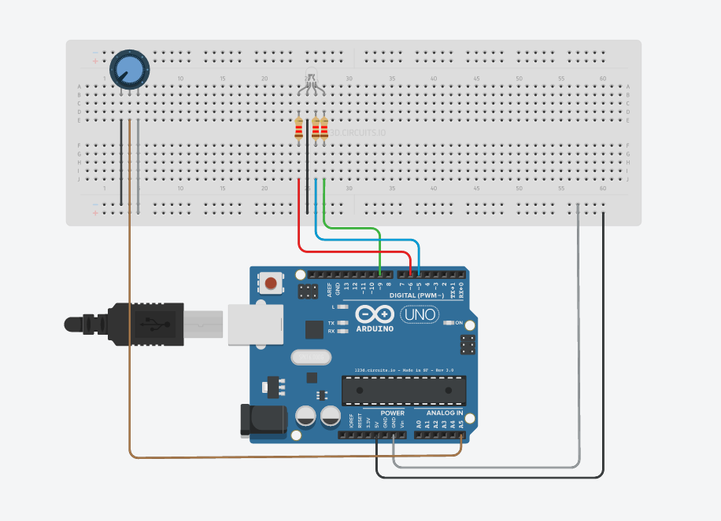

# Aruino-RGB-Diode-Controller
Controlling RGB diode using potentiometer.

Arduino schema:

You can see it on [Autodesk Circuits](https://circuits.io/circuits/3549287-the-unnamed-circuit/edit#breadboard)
